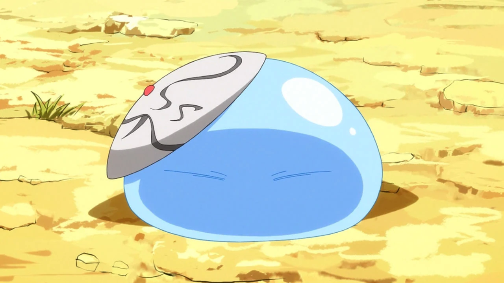
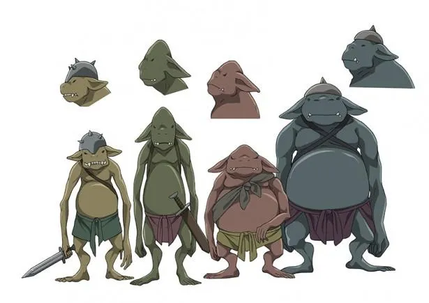
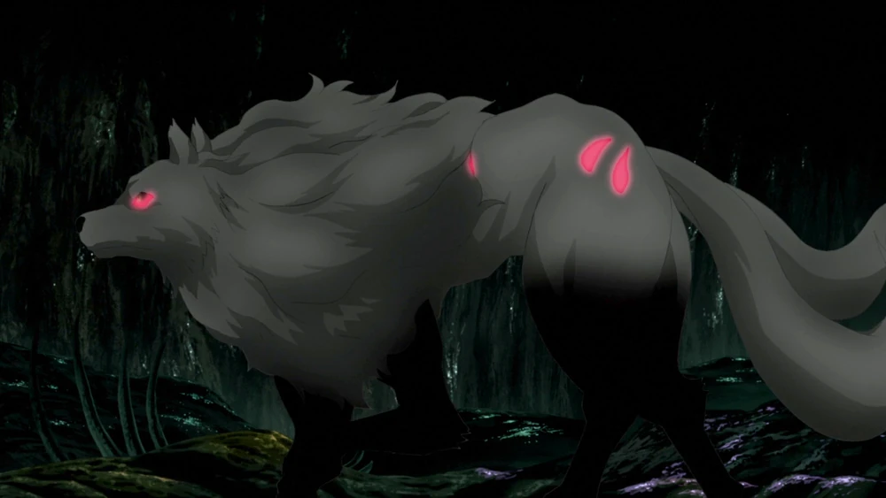
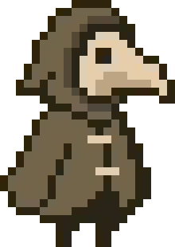
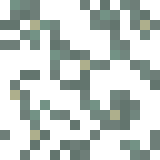
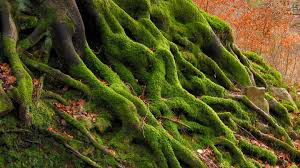
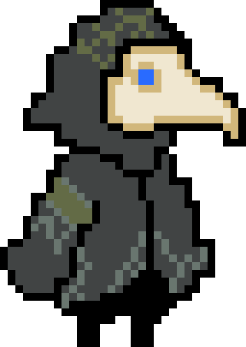
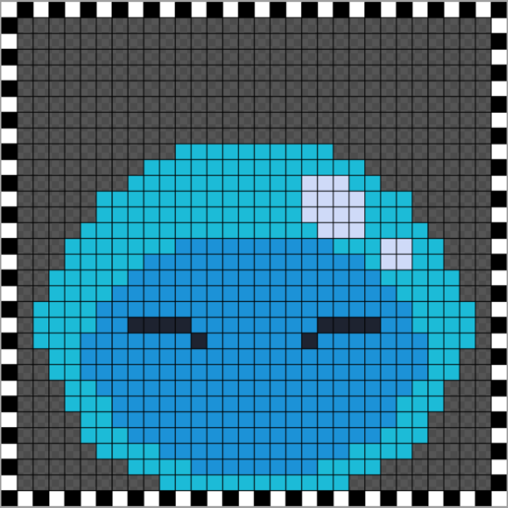
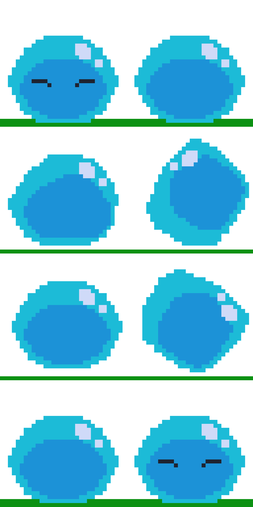

# Introduction
As my course is Immersive Technology I have decided to do as much design as I can whilst focusing on developing code as that is my preference so for my personal project I have decided to create Pixel Art, sticking to a 16x16 or 32x32 size for my work. The main objective of this project is to try and create or re-create characters which could be used in a 2D pixel game. To keep with themes I enjoy I have decided that my work will keep to a more fantasy genre allowing me to express characters which don't have to keep to realism allowing proportions and design ideas to be more creative and not need to follow a specific direction.

## Inspiration
For my Characters I first decided to work on fantasy characters, which I could find online. One of the main characters I decided to work on was a plague doctor with a nature twist to it allowing it to convey story in its design. I however then decided to change my idea, still keeping with the fantasy feel for my character however I wanted to try recreating characters from shows I enjoyed instead as this allowed me to work off of something that already existed as I do struggle to convey my creative Ideas into actual art. Due to this I Decided to use characters from fantasy Anime. The main ones I chose were:

- Remuru Tempest from That Time I Got Reincarnated As A Slime
  
- Goblin from Grimgar of Fantasy and Ash

  
- Twin-tail Wolf from Arifureta: From Commonplace to World's Strongest
  

## Character Creation
These shows have some amazing characters to choose from however I have decided to stick with the monsters from the shows instead. Each monster has a different ranged of complexity, allowing me to practice more and see where my skill level lies. The slime would be my starting point allowing me to see if I can create a simple shape whilst adding subtle details to the art allowing it to not just seem like a simple circle. I would then go onto create The Twin-tail Wolf which has a lot more detail than the slime. This would allow me to see what I can do with a four legged character and how I could animate the legs, head and tails, seeing how I could make a running animation and other animations. Finally I will try to create the Goblin as this in my opinion will be the hardest as it takes on a more humanoid appearance, luckily the Goblins from Grimgar have a simple design which allows me to work on proportions for characters better.

## Plague doctor 
Before I started creating the Characters from the anime, I had made a Plague doctor using a premade plague doctor pixel art from an [essay](https://www.sandromaglione.com/articles/pixel-art-eyes-techniques-and-styles) written by Sandro Maglione. The Doctor from the essay was nice simple design which allowed me to work off of it as a base to re-texture it into something i wanted instead. I used this as an exercise to try and get use to the feeling of creating humanoid creatures and people. 

I wanted my version of the Plague Doctor to be more based in nature instead of within the darker genres that they are in and create almost like a wanderer through nature or a Druid with the re-texture of Plague Doctor. To create this I then went through some concept Ideas and one two of the main things I wanted to capture on the Doctor was Moss like you'd find on tree and rocks, as well as Lichen. I then decided to collect some Images to help me visualise this. The image I chose for moss was a image of a tree that had moss growing up it, like it's climbing up and grabbing hold so I wanted to transfer this idea to my Plague Doctor with some green on him and an armband of moss. For the Lichen I decided to take a picture from the pixel game Minecraft. Minecraft has a type of Lichen called Glow Lichen, which give me the impression of webs and veins that grow across areas of the caves in Minecraft.

To re-texture this Doctor I chose seven colours to create my version of the Doctor I decided on a light and darker cream colour, Blue, Green, a blueish Grey and a blueish green. These colours covered the cloak, mask, moss, lichen and legs. I used most of the black as an outline for the character and legs. As you can see from the image below the character 

## Remuru Tempest Sprite
To create Remuru I decided to start by removing the mask on his head allowing me to have a smoother character to start with, this allows me to try and make a more fluid character. I then decided to look at the colours for the character, as Remuru is a slime he isn't made up of many colour especially as he is an anime character and most characters are kept simple for the younger viewers. so I created my Remuru using four colours a light and dark blue, grey and a blueish white for the shine on his body. This lead to me creating this simple slime body.  

As you can see in the image I created a black and white space within the 32x32 space to allow me to see the sizing and spacing of the sprite. This allowed me to make the slime even and not too close to the edges allowing me to make the sprite circular and easy for me to imagine the character better. I proceeded to make this sprite into a sprite sheet instead. To make the sprite sheet I thought about how the slime should move around if it was going to be in a game and from watching the show Remuru is in, I decided to make the slime jump to move around the scene. This was done using eight different frames creating stationary frames as well as the jump frames. Whilst the sprite jumps to make sure it had motion I would use the lighter blue as the frame to hold the slimes shape, following with the dark blue moving around inside the slime as well. This lead to the slime looking more fluid and moveable allowing for the slime to be moved in different shapes but also give the sprite a 3D feel of depth. To make the slime feel like it was alive more I also added reflection to the slime with to white spots to indicate a reflection on the slime. In most video games Slimes as a character are seen as a liquid meaning the would reflect light from the sun. This all lead to a sprite sheet like this:

Please see below for the Gif of the sprite.

# Referenece
- [That Time I Got Reincarnated As A Slime](https://tensura.fandom.com/wiki/)
- [That Time I Got Reincarnated As A Slime - Remuru](https://tensura.fandom.com/wiki/Rimuru_Tempest/Gallery/Anime)
- [Grimgar of Fantasy and Ash](https://en.namu.wiki/w/재와%20환상의%20그림갈/몬스터)
- [Grimgar of Fantasy and Ash - Goblin](https://en.namu.wiki/w/재와%20환상의%20그림갈/몬스터)
- [Arifureta: From Commonplace to World's Strongest](https://arifureta.fandom.com/wiki/Arifureta_Wiki)
- [Arifureta: From Commonplace to World's Strongest - Twin-tailed Wolf](https://arifureta.fandom.com/wiki/Monster)
- [Piskel used to create the sprite](https://www.piskelapp.com/p/create/sprite/)
- [Pixel art eyes design - Techniques and styles by Sandro Maglione](https://www.sandromaglione.com/articles/pixel-art-eyes-techniques-and-styles)
- [Glow Lichen](https://minecraft.fandom.com/wiki/Glow_Lichen)
- [Moss](https://www.woodlandtrust.org.uk/blog/2020/01/moss-and-trees/)
- [Minecraft](https://www.minecraft.net/en-us)
